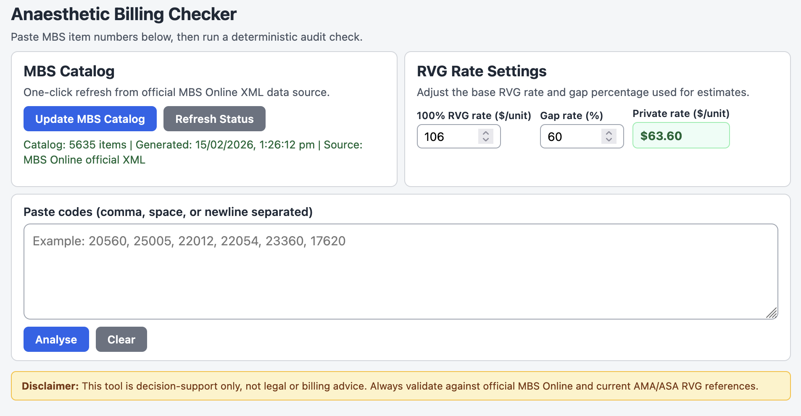
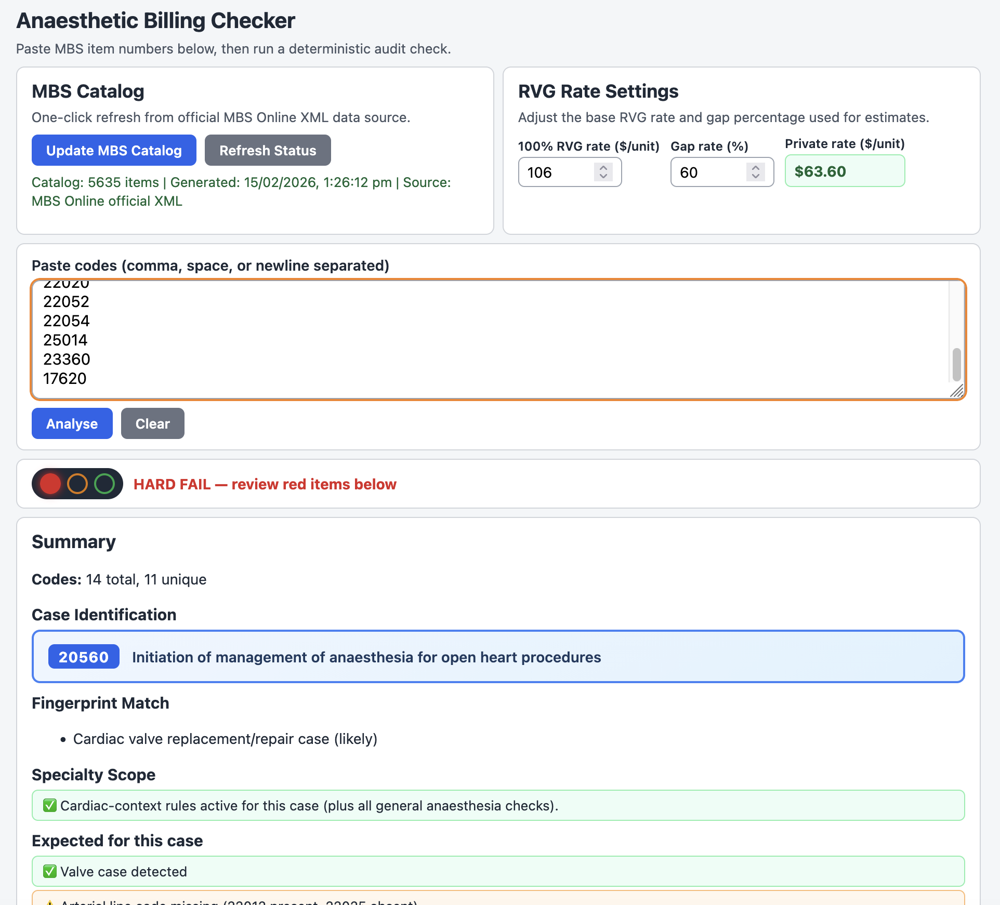

# Anaesthetic Billing Checker

A local tool for checking Australian MBS anaesthesia item numbers before claiming. Paste your codes, get an instant audit with safety checks, warnings, and fee estimates.

**No data leaves your computer.** Everything runs locally in your browser and a small local server.

<p align="center">
  
  <br/>
  
</p>

---

## What it does

- Parses MBS item numbers from pasted text (comma, space, or newline separated)
- Looks up official MBS descriptions and schedule fees
- Calculates MBS schedule fee total, no-gap estimate, and private estimate
- Runs traffic-light safety checks (PASS / QUERY / HARD FAIL)
- Flags audit-risk codes and billing consistency issues
- Shows a per-item code breakdown table
- Configurable RVG base rate and gap percentage

> **Important:** This is a decision-support tool only — not legal or billing advice. Always validate against the [official MBS Online](https://www.mbsonline.gov.au) and current AMA/ASA RVG references.

---

## Getting started

### Step 1: Install Node.js (one-time)

You need **Node.js 18 or newer** installed on your computer. Pick the easiest option for your system:

<details>
<summary><strong>macOS</strong></summary>

**Easiest — download the installer:**
1. Go to [https://nodejs.org](https://nodejs.org)
2. Click the big green **LTS** button to download the `.pkg` installer
3. Double-click the downloaded file and follow the prompts
4. Open **Terminal** (search for "Terminal" in Spotlight) and type `node -v` — you should see a version number

**Alternative — Homebrew:**
```bash
brew install node
```
</details>

<details>
<summary><strong>Windows</strong></summary>

1. Go to [https://nodejs.org](https://nodejs.org)
2. Click the big green **LTS** button to download the `.msi` installer
3. Run the installer and follow the prompts (keep defaults)
4. Open **PowerShell** or **Command Prompt** and type `node -v` — you should see a version number
</details>

<details>
<summary><strong>Linux</strong></summary>

```bash
curl -o- https://raw.githubusercontent.com/nvm-sh/nvm/v0.40.1/install.sh | bash
source ~/.bashrc
nvm install --lts
```
</details>

### Step 2: Install dependencies (one-time)

Open a terminal in the project folder and run:

```bash
npm install
```

### Step 3: Start the app

**macOS — double-click (easiest):**

Double-click **start-billing-app.command** in Finder. The app opens automatically in your browser.
To stop: double-click **stop-billing-app.command**.

**Windows — double-click (easiest):**

Double-click **start-billing-app.bat**. The app opens automatically in your browser.
To stop: double-click **stop-billing-app.bat**.

**Linux — run the script:**

```bash
./start-billing-app.sh
```

To stop: `./stop-billing-app.sh` or press `Ctrl+C` in the terminal.

**Any platform — terminal method:**

```bash
npm start
```

Then open [http://localhost:8080](http://localhost:8080) in your browser. Press `Ctrl+C` in the terminal to stop.

---

## Keeping MBS data up to date

The app automatically checks for the latest MBS data on first launch. You can also update manually:

- **In the app:** Click the **Update MBS Catalog** button
- **From terminal:** `npm run update:mbs`

Data comes from the official [MBS Online XML downloads](https://www.mbsonline.gov.au/internet/mbsonline/publishing.nsf/Content/downloads).

---

## Project structure

```
├── app/
│   ├── index.html          Main page
│   ├── styles.css           Styling
│   ├── app.js               All checker logic
│   └── mbs-data.js          Generated MBS data (auto-created on first run)
├── scripts/
│   ├── web-server.mjs       Local server
│   ├── update-mbs-data.mjs  Fetches official MBS XML
│   └── acceptance-tests.mjs Automated test suite
├── start-billing-app.command   macOS one-click start
├── stop-billing-app.command    macOS one-click stop
├── start-billing-app.bat        Windows one-click start
├── stop-billing-app.bat         Windows one-click stop
├── start-billing-app.sh         Linux start script
├── stop-billing-app.sh          Linux stop script
├── package.json
├── LICENSE
└── README.md
```

---

## Running tests

```bash
node scripts/acceptance-tests.mjs
```

See [ACCEPTANCE_TESTS.md](ACCEPTANCE_TESTS.md) for the test case definitions.

---

## Contributing

1. Fork the repository
2. Create a feature branch
3. Make changes with clear, focused commits
4. Run tests: `node scripts/acceptance-tests.mjs`
5. Open a pull request

---

## License

[MIT](LICENSE) — see [THIRD_PARTY_LICENSES.md](THIRD_PARTY_LICENSES.md) for dependency licenses.
